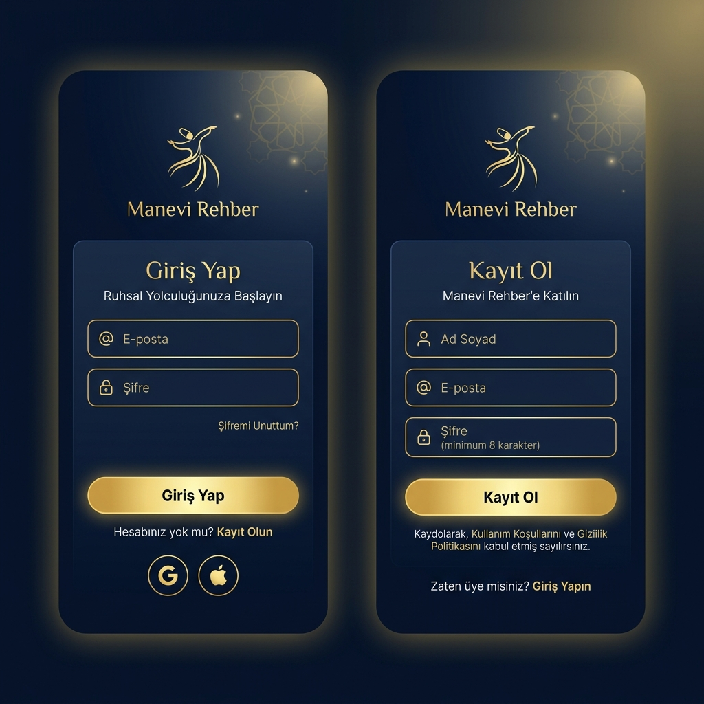
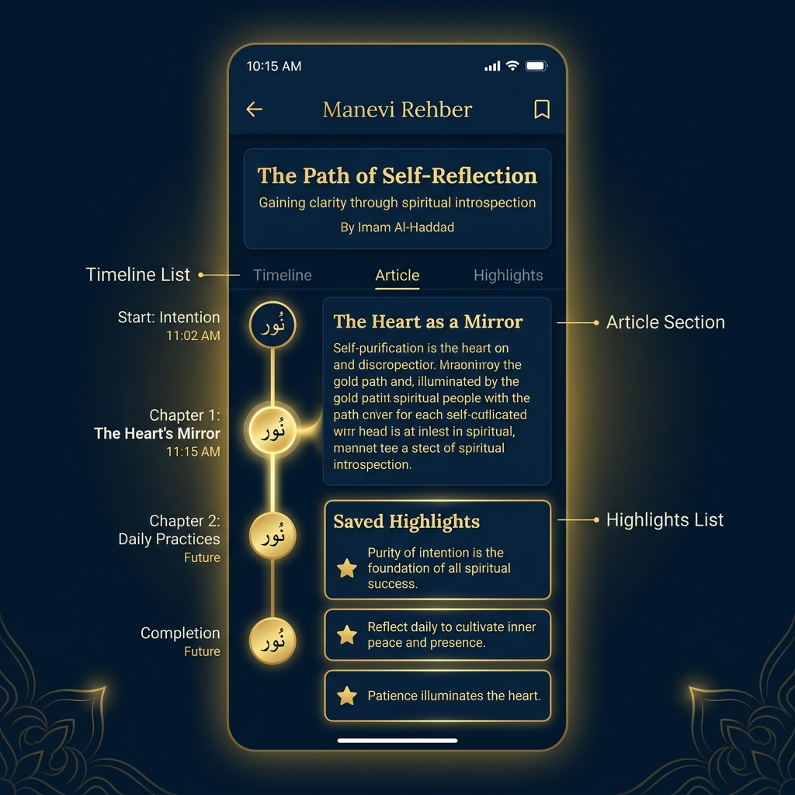

# 🕋 Manevi Rehber - Mobil Programlama Final Projesi

<p align="center">
  <b>Anadolu İrfanı ve Tasavvuf Kültürünü Modern Yapay Zekâ ile Birleştiren Mobil Gönül Rehberliği Uygulaması</b>
</p>

<p align="center">
  
  
  
</p>

---

## 📌 Proje Hakkında

**Manevi Rehber**, modern dünyanın getirdiği dijital yalnızlık, gelecek kaygısı ve stres gibi sorunlara Anadolu irfanının (Mevlânâ, Yunus Emre, Hacı Bektaş-ı Veli, Aşık Veysel vb.) kadim bilgelik süzgecinden geçmiş çözümler sunan bir React Native (Expo) mobil uygulamasıdır. 

Uygulama, hem **Gemini Yapay Zekâ API'si** aracılığıyla kullanıcılarla canlı ve bilgece sohbetler gerçekleştirir hem de internet/API kısıtlamaları durumunda tamamen **çevrimdışı (offline) yerel yapay zekâ motoru** ile kesintisiz bir deneyim sunar.

---

## ✨ Temel Özellikler

### 1. 🤖 BilgeAI Sohbet Motoru
*   Mevlânâ, Yunus Emre ve Hacı Bektaş-ı Veli üslubuyla konuşan yapay zekâ asistanı.
*   Her yanıtta bilgece bir şiir, beyit veya alıntı paylaşımı.
*   Kilitlenmeyen, akıcı ve kullanıcı dostu mesajlaşma arayüzü (UX).
*   API anahtarı bulunmadığında otomatik olarak devreye giren zengin **Çevrimdışı İrfan Havuzu**.

### 2. 🎮 Oyunlaştırma & Seviye (Makâm) Sistemi
*   Uygulama içi aktivitelerle (AI ile sohbet etme, bilge kartlarını okuma vb.) kazanılan **İlahi Nur Puanı (IP)**.
*   Kademeli makâm/seviye sistemi:
    *   **Müptedi** (Başlangıç)
    *   **Sâlik** (Yolda Olan)
    *   **Ârif** (Bilen)
    *   **Mutasavvıf** (Olgunlaşan)
*   Seviye atlandığında tetiklenen, 60fps akıcılığında özel tasarlanmış altın renkli **"İlahi Nur" Animasyon Efekti**.
*   Kazanılan altın rozetlerin ve ilerleme çubuğunun profil ekranında gösterimi.

### 3. 📂 MVVM Yazılım Mimarisi 
*   Spagetti koddan uzak, sektör standartlarına uygun klasör yapısı:
    *   `src/components/`: Yeniden kullanılabilir arayüz bileşenleri.
    *   `src/screens/`: Görünüm katmanları (View).
    *   `src/context/`: Durum yönetimi ve veri akışı (ViewModel mantığı).
    *   `src/services/`: API ve Yerel Depolama servisleri (Model / Controller).
    *   `src/config/`: Firebase ve Çevre değişkenleri ayarları.

### 4. ☁️ Firebase & Güvenli Yerel Depolama Fallback
*   Firebase Authentication ve Cloud Firestore entegrasyonu.
*   İnternet bağlantısı veya Firebase konfigürasyonu eksik olduğunda otomatik devreye giren **Yerel Çevrimdışı Auth & Veri Tabanı (AsyncStorage)**. Proje, değerlendirme esnasında çevrimdışı olsa dahi sıfır hata ile çalışır.

---

## 🛠️ Kurulum ve Çalıştırma

Proje Windows ve macOS ortamlarında çalıştırılmaya hazır haldedir.

### Gereksinimler
*   Node.js (LTS sürümü önerilir)
*   Expo Go uygulaması (Mobil cihazda test etmek için)

### Adımlar

1.  **Bağımlılıkları Yükleyin:**
    ```bash
    npm install
    ```

2.  **Uygulamayı Başlatın:**
    *   Windows kullanıyorsanız, proje kök dizinindeki **`BASLAT.cmd`** dosyasına çift tıklayarak menüden kolayca başlatabilirsiniz.
    *   Veya terminalden manuel olarak:
        ```bash
        npx expo start
        ```

3.  **Test Etme:**
    *   Tarayıcıda test etmek için açılan terminalde `w` tuşuna basarak web sürümünü açabilirsiniz.
    *   Telefonunuzda test etmek için Expo Go uygulaması ile ekrandaki QR kodu taratabilirsiniz.

---

## 📝 Teslim Bilgileri

*   **Ders:** Mobil Programlama
*   **Ödev Tipi:** Final Ödevi
*   **Geliştirici:** Haticenur ERCAN
